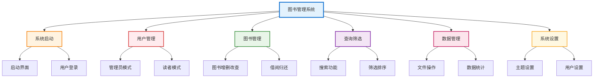

# 图书管理系统功能框架图

## 功能框架图

## 功能说明

### 🌟 系统启动
- 启动界面、用户登录

### 👥 用户管理
- 管理员模式、读者模式

### 📚 图书管理
- 图书增删改查、借阅归还

### 🔍 查询筛选
- 搜索功能、筛选排序

### 💾 数据管理
- 文件操作、数据统计

### ⚙️ 系统设置
- 主题设置、用户设置

## 系统特点

- **模块化设计**: 6个主要功能模块
- **权限管理**: 管理员/读者双模式
- **技术架构**: Qt6 + C++，JSON存储
- **用户体验**: 现代化UI，主题切换