# 图书管理系统功能框架图

## 系统概述

基于Qt框架开发的图书管理系统，采用模块化设计，支持管理员和读者两种用户模式，提供完整的图书管理、查询筛选、数据统计等功能。

## 功能框架图

```mermaid
graph TD
    A[图书管理系统] --> B[系统启动模块]
    A --> C[用户管理模块]
    A --> D[图书管理模块]
    A --> E[查询筛选模块]
    A --> F[排序功能模块]
    A --> G[数据管理模块]
    A --> H[系统设置模块]
    A --> I[界面更新模块]
    
    B --> B1[程序启动]
    B --> B2[启动界面 SplashScreen]
    B --> B3[登录对话框 LoginDialog]
    B --> B4[用户验证]
    
    C --> C1[管理员模式]
    C --> C2[读者模式]
    C1 --> C11[完整权限]
    C1 --> C12[图书增删改查]
    C1 --> C13[借阅管理]
    C1 --> C14[数据统计]
    C2 --> C21[查询权限]
    C2 --> C22[借阅权限]
    C2 --> C23[信息查看]
    
    D --> D1[图书信息管理]
    D --> D2[借阅归还管理]
    D1 --> D11[新增图书]
    D1 --> D12[编辑图书]
    D1 --> D13[删除图书]
    D1 --> D14[图书信息显示]
    D2 --> D21[借阅图书]
    D2 --> D22[归还图书]
    D2 --> D23[借阅状态查询]
    D2 --> D24[到期提醒]
    
    E --> E1[搜索功能]
    E --> E2[筛选功能]
    E --> E3[分类查询]
    E1 --> E11[关键词搜索]
    E1 --> E12[模糊搜索]
    E1 --> E13[精确搜索]
    E2 --> E21[按分类筛选]
    E2 --> E22[按位置筛选]
    E2 --> E23[按状态筛选]
    E2 --> E24[按价格筛选]
    E3 --> E31[可借图书]
    E3 --> E32[已借图书]
    E3 --> E33[热门图书]
    E3 --> E34[最新图书]
    
    F --> F1[基础排序]
    F --> F2[高级排序]
    F1 --> F11[按名称排序]
    F1 --> F12[按分类排序]
    F1 --> F13[按位置排序]
    F2 --> F21[按价格排序]
    F2 --> F22[按日期排序]
    F2 --> F23[按借阅次数排序]
    
    G --> G1[文件操作]
    G --> G2[数据备份]
    G --> G3[数据统计]
    G1 --> G11[打开文件]
    G1 --> G12[保存文件]
    G1 --> G13[导入数据]
    G1 --> G14[导出数据]
    G2 --> G21[自动备份]
    G2 --> G22[手动备份]
    G2 --> G23[数据恢复]
    G3 --> G31[图书统计]
    G3 --> G32[借阅统计]
    G3 --> G33[分类统计]
    G3 --> G34[位置统计]
    
    H --> H1[主题设置]
    H --> H2[字体设置]
    H --> H3[用户设置]
    H --> H4[系统信息]
    H1 --> H11[深色主题]
    H1 --> H12[浅色主题]
    H1 --> H13[主题切换]
    H2 --> H21[字体大小]
    H2 --> H22[字体族]
    H2 --> H23[字体预览]
    H3 --> H31[用户模式切换]
    H3 --> H32[权限管理]
    H4 --> H41[系统版本]
    H4 --> H42[关于信息]
    H4 --> H43[帮助文档]
    
    I --> I1[界面刷新]
    I --> I2[状态更新]
    I --> I3[权限更新]
    I1 --> I11[表格刷新]
    I1 --> I12[数据重载]
    I2 --> I21[状态栏更新]
    I2 --> I22[统计信息更新]
    I3 --> I31[菜单权限]
    I3 --> I32[按钮权限]
    I3 --> I33[功能权限]
    
    style A fill:#e3f2fd,stroke:#1976d2,stroke-width:3px
    style B fill:#fff3e0,stroke:#f57c00,stroke-width:2px
    style C fill:#ffebee,stroke:#d32f2f,stroke-width:2px
    style D fill:#e8f5e8,stroke:#388e3c,stroke-width:2px
    style E fill:#f3e5f5,stroke:#7b1fa2,stroke-width:2px
    style F fill:#e0f2f1,stroke:#00695c,stroke-width:2px
    style G fill:#fce4ec,stroke:#c2185b,stroke-width:2px
    style H fill:#fff8e1,stroke:#f9a825,stroke-width:2px
    style I fill:#e1f5fe,stroke:#0277bd,stroke-width:2px
```

## 功能模块详细说明

### 🌟 系统启动模块
负责程序的初始化、启动界面显示和用户登录验证
- **程序启动**: 创建QApplication实例
- **启动界面**: 显示SplashScreen动画
- **登录对话框**: 用户身份验证
- **用户验证**: 验证用户名和密码

### 👥 用户管理模块
管理不同用户类型的权限和功能访问
- **管理员模式**: 拥有完整系统权限
- **读者模式**: 限制部分管理功能
- **权限控制**: 动态调整界面功能可用性

### 📚 图书管理模块
核心业务功能，处理图书的完整生命周期
- **图书信息管理**: 增删改查图书基本信息
- **借阅归还管理**: 处理图书借阅和归还流程
- **状态管理**: 跟踪图书借阅状态和到期时间

### 🔍 查询筛选模块
提供强大的搜索和筛选功能
- **搜索功能**: 支持多种搜索方式
- **筛选功能**: 按不同维度筛选图书
- **分类查询**: 提供预定义的查询选项

### 📊 排序功能模块
支持多种排序方式，提升用户体验
- **基础排序**: 常用的排序方式
- **高级排序**: 复杂的多维度排序

### 💾 数据管理模块
处理数据的持久化和统计分析
- **文件操作**: 数据的导入导出
- **数据备份**: 自动和手动备份机制
- **数据统计**: 全面的统计分析功能

### ⚙️ 系统设置模块
提供系统配置和个性化设置
- **主题设置**: 深色/浅色主题切换
- **字体设置**: 字体大小和族的选择
- **用户设置**: 用户偏好配置
- **系统信息**: 版本信息和帮助文档

### 🔄 界面更新模块
负责界面的实时更新和状态同步
- **界面刷新**: 数据变更后的界面更新
- **状态更新**: 状态栏和统计信息更新
- **权限更新**: 根据用户权限动态调整界面

## 技术架构特点

### 🏗️ 模块化设计
- 每个模块职责明确，相互独立
- 模块间通过标准接口通信
- 易于维护和扩展

### 🔒 权限管理
- 基于角色的权限控制
- 动态权限调整
- 安全的用户验证

### 📱 用户体验
- 现代化UI设计
- 响应式界面更新
- 丰富的交互反馈

### 🔧 可扩展性
- 插件化架构设计
- 标准化的接口规范
- 易于添加新功能

## 系统优势

1. **清晰的层次结构**: 功能模块层次分明，易于理解
2. **模块化设计**: 各模块独立，便于维护和测试
3. **权限管理**: 灵活的用户权限控制机制
4. **用户体验**: 直观的操作界面和丰富的功能
5. **数据安全**: 完善的数据备份和恢复机制
6. **扩展性强**: 易于添加新功能和模块
7. **跨平台支持**: 基于Qt框架，支持多平台部署

## 开发建议

基于此功能框架图，开发团队可以：
- 按模块分工开发，提高开发效率
- 明确各模块的接口规范
- 制定统一的测试标准
- 建立模块化的部署方案
