# 图书管理系统功能框架图

## 系统概述

基于Qt框架开发的图书管理系统，采用模块化设计，支持管理员和读者两种用户模式，提供完整的图书管理、查询筛选、数据统计等功能。

## 功能框架图

```mermaid
graph TD
    A[图书管理系统] --> B[系统启动]
    A --> C[用户管理]
    A --> D[图书管理]
    A --> E[查询筛选]
    A --> F[数据管理]
    A --> G[系统设置]
    
    B --> B1[启动界面]
    B --> B2[用户登录]
    B --> B3[权限验证]
    
    C --> C1[管理员模式]
    C --> C2[读者模式]
    C1 --> C11[完整权限]
    C2 --> C21[查询权限]
    
    D --> D1[图书增删改查]
    D --> D2[借阅归还]
    D1 --> D11[新增图书]
    D1 --> D12[编辑图书]
    D1 --> D13[删除图书]
    D2 --> D21[借阅图书]
    D2 --> D22[归还图书]
    
    E --> E1[搜索功能]
    E --> E2[筛选功能]
    E --> E3[排序功能]
    E1 --> E11[关键词搜索]
    E2 --> E21[按分类筛选]
    E2 --> E22[按状态筛选]
    E3 --> E31[按名称排序]
    E3 --> E32[按价格排序]
    
    F --> F1[文件操作]
    F --> F2[数据备份]
    F --> F3[统计分析]
    F1 --> F11[导入导出]
    F2 --> F21[备份恢复]
    F3 --> F31[图书统计]
    
    G --> G1[主题设置]
    G --> G2[字体设置]
    G --> G3[用户设置]
    G1 --> G11[深色/浅色主题]
    G2 --> G21[字体大小]
    G3 --> G31[模式切换]
    
    style A fill:#e3f2fd,stroke:#1976d2,stroke-width:3px
    style B fill:#fff3e0,stroke:#f57c00,stroke-width:2px
    style C fill:#ffebee,stroke:#d32f2f,stroke-width:2px
    style D fill:#e8f5e8,stroke:#388e3c,stroke-width:2px
    style E fill:#f3e5f5,stroke:#7b1fa2,stroke-width:2px
    style F fill:#fce4ec,stroke:#c2185b,stroke-width:2px
    style G fill:#fff8e1,stroke:#f9a825,stroke-width:2px
```

## 功能模块说明

### 🌟 系统启动
- 启动界面显示
- 用户登录验证
- 权限验证

### 👥 用户管理
- **管理员模式**: 完整系统权限
- **读者模式**: 查询和借阅权限

### 📚 图书管理
- **图书增删改查**: 新增、编辑、删除图书
- **借阅归还**: 处理图书借阅和归还

### 🔍 查询筛选
- **搜索功能**: 关键词搜索
- **筛选功能**: 按分类、状态筛选
- **排序功能**: 按名称、价格排序

### 💾 数据管理
- **文件操作**: 导入导出数据
- **数据备份**: 备份和恢复
- **统计分析**: 图书统计信息

### ⚙️ 系统设置
- **主题设置**: 深色/浅色主题
- **字体设置**: 字体大小调整
- **用户设置**: 模式切换

## 系统特点

### 🏗️ 模块化设计
- 6个主要功能模块，职责明确
- 模块间独立，易于维护

### 🔒 权限管理
- 管理员/读者双模式
- 动态权限控制

### 📱 用户体验
- 现代化UI设计
- 深色/浅色主题切换

### 🔧 技术架构
- 基于Qt6 + C++
- JSON数据存储
- 跨平台支持

## 系统优势

1. **简洁清晰**: 功能模块层次分明
2. **易于维护**: 模块化设计便于开发
3. **用户友好**: 直观的操作界面
4. **扩展性强**: 易于添加新功能
