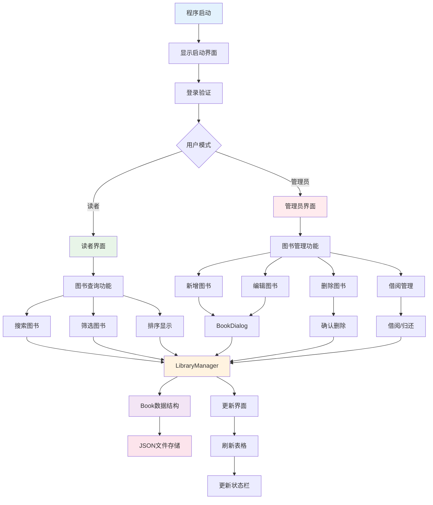

# 图书管理系统流程图

## 系统概述

这是一个基于Qt框架开发的图书管理系统，支持图书的增删改查、借阅归还、数据统计等功能，具有管理员和读者两种用户模式。

## 核心架构流程图

## 主要组件说明

### 1. 核心类结构
- **MainWindow**: 主窗口类，负责界面展示和用户交互
- **LibraryManager**: 图书管理核心类，处理所有业务逻辑
- **Book**: 图书数据结构
- **BookDialog**: 图书编辑对话框
- **LoginDialog**: 登录对话框
- **SplashScreen**: 启动界面

### 2. 功能模块

#### 图书管理模块
- 新增图书：通过BookDialog输入图书信息
- 编辑图书：修改现有图书信息
- 删除图书：删除指定图书
- 借阅管理：处理图书借阅和归还

#### 查询筛选模块
- 搜索功能：支持按书名、分类、位置、索引号搜索
- 筛选功能：按分类、位置、状态筛选
- 排序功能：按名称、价格、日期、借阅次数排序

#### 数据管理模块
- 文件操作：打开、保存JSON文件
- 数据导入导出：支持数据备份和恢复
- 统计信息：显示图书统计和热门分类

### 3. 用户权限

#### 管理员模式
- 完整的图书管理权限
- 可以增删改查图书
- 可以管理借阅状态
- 访问所有功能模块

#### 读者模式
- 只能查询和借阅图书
- 无法编辑或删除图书
- 限制部分管理功能

### 4. 数据流程

1. **用户操作** → MainWindow接收用户输入
2. **业务处理** → LibraryManager处理业务逻辑
3. **数据存储** → Book数据结构 → JSON文件持久化
4. **界面更新** → 刷新表格显示 → 更新状态栏信息

## 技术特点

- **界面框架**: Qt6 + C++
- **数据存储**: JSON格式文件
- **主题支持**: 深色/浅色主题切换
- **权限管理**: 管理员/读者双模式
- **用户体验**: 现代化UI设计，支持动画效果

## 系统优势

1. **模块化设计**: 界面与业务逻辑分离
2. **数据安全**: 支持数据备份和恢复
3. **用户友好**: 直观的操作界面和丰富的功能
4. **扩展性强**: 易于添加新功能和模块
5. **跨平台**: 基于Qt框架，支持多平台部署
