# 图书管理系统类图

```mermaid
classDiagram
    %% 核心数据类
    class Book {
        +QString indexId
        +QString name
        +QString location
        +QString category
        +int quantity
        +double price
        +QDate inDate
        +QDate returnDate
        +int borrowCount
        +bool available
    }

    %% 业务逻辑类
    class LibraryManager {
        -QVector~Book~ books_
        +loadFromFile(filePath) bool
        +saveToFile(filePath) bool
        +addBook(book) bool
        +removeBookByIndexId(indexId) bool
        +updateBook(indexId, book) bool
        +findByName(name) Book*
        +borrowBook(indexId, dueDate) bool
        +returnBook(indexId) bool
        +getAll() QVector~Book~
        +getDueInDays(days) QVector~Book~
        +sortByBorrowCountDesc()
        +getByCategory(category) QVector~Book~
        +getByLocation(location) QVector~Book~
        +getAvailable() QVector~Book~
        +getBorrowed() QVector~Book~
        +searchBooks(keyword) QVector~Book~
        +getTopBorrowed(limit) QVector~Book~
        +getRecentlyAdded(days) QVector~Book~
        +getExpensiveBooks(minPrice) QVector~Book~
        +getCheapBooks(maxPrice) QVector~Book~
        +getTotalBooks() int
        +getAvailableBooks() int
        +getBorrowedBooks() int
        +getBooksByCategory(category) int
        +getTotalValue() double
        +getMostPopularCategory() QString
        +getMostPopularLocation() QString
        +sortByName()
        +sortByCategory()
        +sortByLocation()
        +sortByPrice()
        +sortByDate()
        +sortByBorrowCount()
        -findIndexById(indexId) int
    }

    %% 主窗口类
    class MainWindow {
        -Ui::MainWindow* ui
        -LibraryManager library_
        -QStandardItemModel* model_
        -QTableView* tableView_
        -bool adminMode_
        -QString currentUser_
        -QLineEdit* searchEdit_
        -QPushButton* searchButton_
        -bool isDarkMode_
        -QPushButton* themeToggleButton_
        -QMenuBar* menuBar_
        -QMenu* bookMenu_
        -QMenu* queryMenu_
        -QMenu* sortMenu_
        -QMenu* dataMenu_
        -QMenu* systemMenu_
        -QFont currentFont_
        -int fontSize_
        +setUserMode(isAdmin)
        +setCurrentUser(username)
        +isAdminMode() bool
        +getCurrentUser() QString
        -setupTable()
        -refreshTable(books)
        -setupActions()
        -setupStyles()
        -updateUIForUserMode()
        -updateStatusBar()
        -createDockWidgetFromScrollArea(scrollArea) QDockWidget*
        -setupSearchBar()
        -setupThemeToggle()
        -toggleTheme()
        -applyTheme(isDark)
        -getThemeStyles(isDark) QString
        -initializeSampleBooks()
        -setupMenuBar()
        -setupFontSettings()
        -applyFontSettings()
        +onAdd()
        +onEdit()
        +onRemove()
        +onBorrow()
        +onReturn()
        +onSearch()
        +onShowDue()
        +onSortByBorrow()
        +onOpen()
        +onSave()
        +onShowAll()
        +onSwitchMode()
        +onFilterByCategory()
        +onFilterByLocation()
        +onShowAvailable()
        +onShowBorrowed()
        +onShowTopBorrowed()
        +onShowRecentlyAdded()
        +onShowExpensiveBooks()
        +onShowCheapBooks()
        +onShowStatistics()
        +onSortByName()
        +onSortByCategory()
        +onSortByLocation()
        +onSortByPrice()
        +onSortByDate()
        +onSortByBorrowCount()
        +onAdvancedSearch()
        +onExportData()
        +onImportData()
        +onBackupData()
        +onRestoreData()
        +onFontSettings()
        +onFontSizeChanged(size)
        +onFontFamilyChanged(family)
    }

    %% 图书编辑对话框类
    class BookDialog {
        -QLineEdit* indexIdEdit_
        -QLineEdit* nameEdit_
        -QComboBox* locationEdit_
        -QComboBox* categoryEdit_
        -QLineEdit* quantityEdit_
        -QLineEdit* priceEdit_
        -QDateEdit* inDateEdit_
        -QDateEdit* returnDateEdit_
        -QLineEdit* borrowCountEdit_
        -QCheckBox* availableCheck_
        +setBook(book)
        +getBook() Book
    }

    %% 登录对话框类
    class LoginDialog {
        -QLabel* titleLabel
        -QLabel* subtitleLabel
        -QLineEdit* usernameEdit
        -QLineEdit* passwordEdit
        -QPushButton* loginButton
        -QPushButton* cancelButton
        -QPushButton* adminModeButton
        -QGraphicsOpacityEffect* opacityEffect
        -QPropertyAnimation* fadeInAnimation
        -bool adminMode
        -QString currentUsername
        -QString currentPassword
        +getUsername() QString
        +getPassword() QString
        +isAdminMode() bool
        +onLogin()
        +onCancel()
        +onAdminModeToggle(checked)
        -setupUI()
        -setupAnimations()
        -setupStyles()
        -showEvent(event)
        -paintEvent(event)
        -validateCredentials(username, password) bool
        -validateAdminPassword(password) bool
    }

    %% 启动画面类
    class SplashScreen {
        -QLabel* titleLabel
        -QLabel* subtitleLabel
        -QLabel* designerLabel
        -QLabel* universityLabel
        -QTimer* fadeTimer
        -QTimer* progressTimer
        -QPropertyAnimation* fadeInAnimation
        -QPropertyAnimation* fadeOutAnimation
        -QGraphicsOpacityEffect* opacityEffect
        -bool isFadingOut
        -int progressValue
        +showSplash()
        +hideSplash()
        +splashFinished()$
        +updateProgress()
        +fadeIn()
        +fadeOut()
        -setupUI()
        -setupAnimations()
        -paintEvent(event)
    }

    %% Qt框架类
    class QMainWindow {
        <<Qt Framework>>
    }

    class QDialog {
        <<Qt Framework>>
    }

    class QWidget {
        <<Qt Framework>>
    }

    class QObject {
        <<Qt Framework>>
    }

    %% 关系定义
    MainWindow --|> QMainWindow
    BookDialog --|> QDialog
    LoginDialog --|> QDialog
    SplashScreen --|> QWidget
    LibraryManager --|> QObject

    MainWindow --> LibraryManager : 使用
    MainWindow --> BookDialog : 创建
    BookDialog --> Book : 编辑
    LibraryManager --> Book : 管理
    LoginDialog --> MainWindow : 设置用户模式
    SplashScreen --> LoginDialog : 完成后显示

    %% 聚合关系
    LibraryManager o-- Book : 包含多个
    MainWindow o-- LibraryManager : 包含

    %% 依赖关系
    MainWindow ..> Book : 显示数据
    BookDialog ..> Book : 编辑数据
```

## 类图说明

### 核心类说明：

1. **Book（图书类）**
   - 数据结构，包含图书的所有属性
   - 支持JSON序列化/反序列化

2. **LibraryManager（图书管理器）**
   - 核心业务逻辑类
   - 负责图书的增删改查、借阅归还、统计排序等功能
   - 管理内存中的图书集合和文件持久化

3. **MainWindow（主窗口）**
   - 程序的主界面
   - 包含用户模式管理、主题切换、字体设置等功能
   - 提供丰富的菜单和工具栏操作

4. **BookDialog（图书编辑对话框）**
   - 用于添加和编辑图书信息
   - 包含所有图书属性的输入控件

5. **LoginDialog（登录对话框）**
   - 用户登录界面
   - 支持普通用户和管理员模式
   - 包含动画效果

6. **SplashScreen（启动画面）**
   - 程序启动时的欢迎界面
   - 包含淡入淡出动画效果

### 程序流程：
1. 程序启动 → SplashScreen（启动画面）
2. 启动完成 → LoginDialog（登录对话框）
3. 登录成功 → MainWindow（主窗口）
4. 主窗口通过LibraryManager管理图书数据
5. 编辑图书时创建BookDialog对话框
